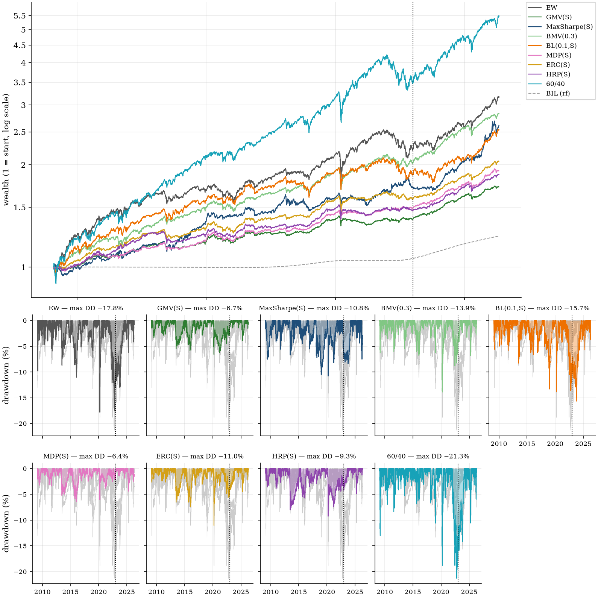

# Applied Portfolio Construction Research

### From mean-variance to risk parity and hierarchical allocation

**Does portfolio optimization beat naive diversification?** We test seven allocation models
(minimum variance, maximum Sharpe, beta-constrained minimum variance, Black–Litterman, most
diversified portfolio, equal risk contribution and hierarchical risk parity), with
covariance shrinkage and a volatility-targeting overlay, in a monthly walk-forward backtest
on 13 cross-asset ETFs from 2009 to 2026, net of costs, against equal weight and 60/40.

**Conclusion:** no optimized portfolio earns a Sharpe ratio statistically distinguishable
from equal weight. The models differ sharply in risk, not in risk-adjusted return, and 17
years of data are too few to separate them.

## Findings

- **No method beats equal weight.** 30 of 30 null hypotheses hold: seven Sharpe-ratio
  tests against EW (Holm) and 23 CAPM-α tests (Romano–Wolf) ([nb08](notebooks/08_method_comparison.ipynb)).
- **The sample is too short to tell them apart.** Detecting a Sharpe gap of 0.2 against EW
  with 80% power would take 34 to 220 years of daily data; 17 are available. The nulls mean
  "indistinguishable", not "equal" ([nb11](notebooks/11_sharpe_inference.ipynb)).
- **Every method beats cash.** Probabilistic Sharpe ratio ≥ 0.996 for all nine core runs,
  and the best of the 23 runs survives deflation for the search ([nb11](notebooks/11_sharpe_inference.ipynb)).
- **Volatility targeting is a drawdown brake.** It cuts volatility to 73–87% of each base
  method and the 2020 drawdown to 42–57%, with no detectable Sharpe change (16 of 16 nulls
  hold) ([nb10](notebooks/10_vol_overlay.ipynb)).
- **Where the models do differ: risk.** Volatility ranges from 3.2% (GMV) to 7.9% (EW),
  market β from 0.04 (HRP) to 0.36 (EW), maximum drawdown from −6.4% (MDP) to −17.8% (EW)
  and turnover from 14% to 248% a year (EW to MaxSharpe). 60/40 has the highest
  full-window Sharpe ratio (0.91) and terminal wealth, at a β of 0.55 and the deepest drawdown (−21.3%)
  ([nb08](notebooks/08_method_comparison.ipynb)).
- **23 runs, about three ideas.** The runs cluster into risk-based, EW-like and
  maximum-Sharpe groups ([nb11](notebooks/11_sharpe_inference.ipynb)).

## Data

Daily adjusted prices for 13 ETFs, one per risk premium, 2008-01-02 to 2026-04-30. BIL
(T-bills) is the risk-free rate and is not allocatable.

| Sleeve | ETFs |
|---|---|
| Equity | SPY, EFA, EEM |
| Rates | IEF, TLT |
| Inflation-linked | TIP |
| Credit | LQD, HYG, EMB |
| Real assets | VNQ, DBC, GLD |
| FX | UUP |

The price data come from a licensed vendor archive and are not distributed.
`scripts/build_panel.py` builds the panel from a CSV with columns Date, Ticker, AdjClose
(see notebook 00).

## Methods

| Notebook | Method | Family | Idea |
|---|---|---|---|
| [00](notebooks/00_data_contract.ipynb) | Data contract | Data | Panel construction, return conventions, data checks |
| [01](notebooks/01_mean_variance.ipynb) | Mean-variance (GMV, MaxSharpe) | Risk-based (GMV), Return-based (MaxSharpe) | Minimum variance; maximum Sharpe ratio on sample moments |
| [02](notebooks/02_capm_beta_target.ipynb) | Beta-targeted minimum variance | Risk-based | Minimum variance subject to a market-β floor |
| [03](notebooks/03_black_litterman.ipynb) | Black–Litterman | Return-based | EW-implied equilibrium prior updated with momentum views |
| [04](notebooks/04_covariance_shrinkage.ipynb) | Covariance shrinkage | Estimator swap | Ledoit–Wolf and OAS in place of the sample covariance |
| [05](notebooks/05_most_diversified.ipynb) | Most diversified portfolio (MDP) | Risk-based | Maximise the diversification ratio |
| [06](notebooks/06_risk_parity_erc.ipynb) | Equal risk contribution (ERC) | Risk-based | Equalise each asset's contribution to portfolio variance |
| [07](notebooks/07_hierarchical_risk_parity.ipynb) | Hierarchical risk parity (HRP) | Risk-based | Cluster the correlation matrix, allocate by inverse variance down the tree |
| [08](notebooks/08_method_comparison.ipynb) | Comparison | Evaluation | Sharpe-ratio tests vs EW; CAPM α with Romano–Wolf |
| [09](notebooks/09_robustness.ipynb) | Robustness | Evaluation | Lookback length, ex-ante volatility bias, rank stability |
| [10](notebooks/10_vol_overlay.ipynb) | Volatility overlay | Overlay | Scale exposure to a volatility target, remainder in T-bills |
| [11](notebooks/11_sharpe_inference.ipynb) | Sharpe inference | Evaluation | PSR, minimum track record, power, deflated Sharpe ratio |

## Design

- **Backtest.** Long-only, month-end rebalancing on a trailing 252-day window, 10 bp per
  unit of turnover, drifted weights between rebalances. Scored 2009-02-02 to 2026-04-30;
  2022-12-31 splits a train and a 3.3-year test window. Benchmarks: EW and 60/40 (SPY/IEF).
- **Inference.** Hypotheses are fixed in `registrations/*.toml` before the tested
  statistics are computed (notebooks 04–10; notebook 11 is descriptive). Newey–West
  standard errors, stationary bootstrap, Holm and Romano–Wolf adjustments; notebooks gate
  their inputs against `registrations/reproduction.toml`.
- **Reference checks.** GMV, maximum-Sharpe, MDP and HRP solvers are tested against
  PyPortfolioOpt (`tests/test_reference.py`).

## Results

Annualised, net of costs. Sharpe ratio in excess of T-bills (BIL). Core configuration of
each method (sample covariance).

| Method | Return | Volatility | Sharpe (full) | Sharpe (test) | Max drawdown |
|---|---|---|---|---|---|
| EW | 7.0% | 7.9% | 0.74 | 0.91 | −17.8% |
| GMV | 3.2% | 3.2% | 0.62 | 0.76 | −6.7% |
| MaxSharpe | 5.8% | 6.3% | 0.72 | 1.13 | −10.8% |
| Beta-targeted MV (0.3) | 6.2% | 5.8% | 0.86 | 1.13 | −13.9% |
| Black–Litterman (0.1) | 5.7% | 6.9% | 0.64 | 0.70 | −15.7% |
| MDP | 3.8% | 3.5% | 0.76 | 0.98 | −6.4% |
| ERC | 4.2% | 3.9% | 0.76 | 0.94 | −11.0% |
| HRP | 3.7% | 3.9% | 0.64 | 0.82 | −9.3% |
| 60/40 | 10.4% | 10.1% | 0.91 | 1.00 | −21.3% |

Full window 2009-02-02 to 2026-04-30 (17.2 years); test window 3.3 years.

## How much 17 years can tell us

An estimated Sharpe ratio is a noisy statistic. Following López de Prado, Lipton &
Zoonekynd (2026), notebook 11 asks how much history each result needs:

- **Beating cash** takes 2.9 to 6.6 years of data at these Sharpe ratios, so the 3.3-year
  test window alone is too short for seven of the nine runs: test results are a
  consistency check, not evidence.
- **Beating EW** is far harder: a true gap of 0.2 in Sharpe would be detected only 12–51%
  of the time in 17 years.
- **Scope.** One universe, one sample, flat costs, monthly rebalancing, long-only. The
  results describe these methods on this data, not portfolio construction in general.

## Reproduce

    python3.12 -m venv .venv && source .venv/bin/activate
    pip install -e ".[dev,ref]" jupyter
    pytest
    cd notebooks && for nb in [01][0-9]_*.ipynb; do jupyter nbconvert --to notebook --execute --inplace "$nb"; done

Requires the price panel described under Data. Python 3.11 or later (developed on 3.12).

## References

- Black, F. & Litterman, R. (1992). Global Portfolio Optimization. Financial Analysts Journal 48(5).
- Choueifaty, Y. & Coignard, Y. (2008). Toward Maximum Diversification. Journal of Portfolio Management 35(1).
- DeMiguel, V., Garlappi, L. & Uppal, R. (2009). Optimal Versus Naive Diversification: How Inefficient Is the 1/N Portfolio Strategy? Review of Financial Studies 22(5).
- Hilpisch, Y. J. (2026). Python and AI for Asset Management: Data Science, Machine Learning, and Modern AI Workflows. Manuscript.
- Hilpisch, Y. J. (2027). Python for Finance (3rd ed.). O'Reilly Media. Early Release.
- Ledoit, O. & Wolf, M. (2004). A Well-Conditioned Estimator for Large-Dimensional Covariance Matrices. Journal of Multivariate Analysis 88(2).
- Ledoit, O. & Wolf, M. (2008). Robust Performance Hypothesis Testing with the Sharpe Ratio. Journal of Empirical Finance 15(5).
- López de Prado, M. (2016). Building Diversified Portfolios that Outperform Out of Sample. Journal of Portfolio Management 42(4).
- López de Prado, M., Lipton, A. & Zoonekynd, V. (2026). How to Use the Sharpe Ratio. ADIA Lab Research Paper 19.
- Maillard, S., Roncalli, T. & Teïletche, J. (2010). The Properties of Equally Weighted Risk Contribution Portfolios. Journal of Portfolio Management 36(4).
- Markowitz, H. (1952). Portfolio Selection. Journal of Finance 7(1).
- Moreira, A. & Muir, T. (2017). Volatility-Managed Portfolios. Journal of Finance 72(4).
- Romano, J. P. & Wolf, M. (2005). Stepwise Multiple Testing as Formalized Data Snooping. Econometrica 73(4).

## Disclaimer

Research code for educational purposes. Nothing here is investment advice or a
recommendation to buy or sell any security. Past performance, simulated or otherwise, does
not predict future results.

## License

Code: MIT (see `LICENSE`). Price data are not included and remain subject to the vendor's
licence.
